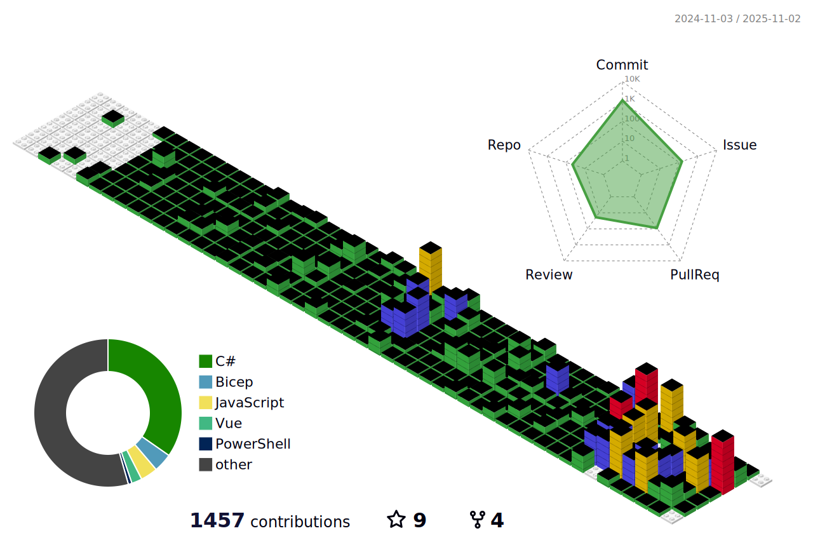

# 🐤 About yutaka-art
Hi, I'm an Azure solution developer and DevOps engineer. 💻

Recipient of the GitHub Stars Award (2025) 🌟

## 🌱 my skills

## 📈 Stats

  
  
  

 
  
  

  
:zap: Stats Detail

 
 

## 📨 Contact me.
**[Gmail - @union.dml](mailto:union.dml@gmail.com)** | **[Portfolio Web](https://yutaka-art.github.io/yutaka-art/index-en.html)**

## 🎧 Spotify Playing

---

  
:zap: Recent GitHub Activity

<!--START_SECTION:activity-->
1. ❗ Opened issue [#3](https://github.com/yutaka-art/gh-issue-bulk-create/issues/3) in [yutaka-art/gh-issue-bulk-create](https://github.com/yutaka-art/gh-issue-bulk-create)
2. ❗ Opened issue [#2](https://github.com/yutaka-art/gh-issue-bulk-create/issues/2) in [yutaka-art/gh-issue-bulk-create](https://github.com/yutaka-art/gh-issue-bulk-create)
3. ❗ Opened issue [#1](https://github.com/yutaka-art/gh-issue-bulk-create/issues/1) in [yutaka-art/gh-issue-bulk-create](https://github.com/yutaka-art/gh-issue-bulk-create)
4. 🔒 Closed issue [#13](https://github.com/yutaka-art/yutaka-art/issues/13) in [yutaka-art/yutaka-art](https://github.com/yutaka-art/yutaka-art)
5. ❗ Opened issue [#13](https://github.com/yutaka-art/yutaka-art/issues/13) in [yutaka-art/yutaka-art](https://github.com/yutaka-art/yutaka-art)
<!--END_SECTION:activity-->

